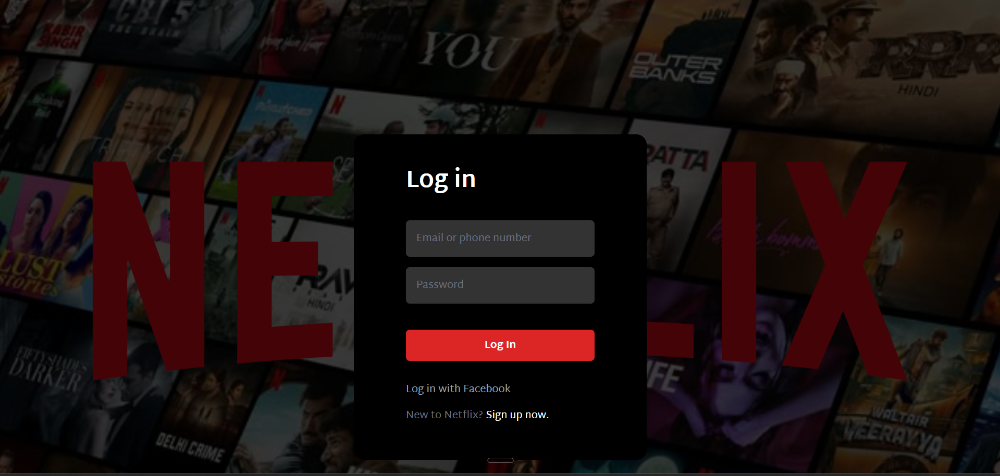

# 🎬 Netflix UI Clone

A Netflix-inspired full stack web application with a **Login / Signup authentication flow** built using **React**, **Node.js**, and **Express**. Users can register, log in, and access the Netflix-style UI upon successful authentication.

---

## 🚀 Features

- 🔐 **Login & Signup Flow** — User can register a new account and log in with existing credentials
- ✅ **Authentication Logic** — Frontend sends user data to backend via POST request and receives success or failure response
- 🔄 **Conditional Routing** — Login success → redirects to Netflix UI, Login failure → redirects back to Signup page to add new user
- 🎨 **Netflix-style UI** — Clean and responsive Netflix-inspired interface
- 📱 **Responsive Design** — Styled with Tailwind CSS for all screen sizes

---

## 🛠️ Tech Stack

| Layer | Technology |
|---|---|
| Frontend | React JS |
| Styling | Tailwind CSS |
| Backend | Node.js, Express |
| Data Storage | In-memory (server-side array) |
| API Method | POST (REST) |

---

## 📁 Project Structure

```
netflix-ui-clone/
├── client/                  # React frontend
│   ├── src/
│   │   ├── components/      # Login, Signup, Netflix UI components
│   │   ├── App.jsx          # Route logic (login → UI or signup)
│   │   └── main.jsx
│   └── public/
├── server/                  # Node.js + Express backend
│   └── index.js             # POST routes for login & signup
├── package.json
└── README.md
```

---

## 🔁 Authentication Flow

```
User visits app
      │
      ▼
  Login Page
      │
  Enter credentials
      │
  POST /api/login ──► Backend checks in-memory users
      │
  ┌───┴───┐
  │       │
 TRUE   FALSE
  │       │
  ▼       ▼
Netflix  Signup Page
  UI    (Add new user)
              │
         POST /api/signup
              │
         User added to memory
              │
         Redirect to Login
```

---

## 🌐 API Endpoints

| Method | Endpoint | Description |
|---|---|---|
| POST | `/api/login` | Validates user credentials, returns true or false |
| POST | `/api/signup` | Registers a new user into in-memory storage |

---

## ⚙️ Getting Started

### Prerequisites

- Node.js v18+
- npm or yarn

### Installation

1. **Clone the repository**
   ```bash
   git clone https://github.com/your-username/netflix-ui-clone.git
   cd netflix-ui-clone
   ```

2. **Install server dependencies**
   ```bash
   cd server
   npm install
   ```

3. **Install client dependencies**
   ```bash
   cd ../client
   npm install
   ```

4. **Run the backend server**
   ```bash
   cd server
   node index.js
   ```

5. **Run the React frontend**
   ```bash
   cd client
   npm run dev
   ```

6. Open your browser at `http://localhost:5173`

---

## 📸 Screenshots

| Login Page | Signup Page | Netflix UI |
|---|---|---|
|  |  |  |

---

## ⚠️ Note

> This project currently uses **in-memory storage** for user data, which means registered users will reset when the server restarts. MongoDB integration is planned as the next upgrade.

---

## 🔮 Upcoming Improvements

- [ ] Connect MongoDB to persist user data
- [ ] Add JWT-based session management
- [ ] Add protected routes on the frontend
- [ ] Improve Netflix UI with more sections and content

---

## 🙋‍♂️ Author

**Arun**
- GitHub: [@your-username](https://github.com/Arunkumar1321)
- LinkedIn: [your-linkedin](https://linkedin.com/in/arun-kumar-1325d)

---

## 📄 License

This project is open source and available under the [MIT License](LICENSE).
